# 01 - Introdução ao Ansible Lab

**🏷️ Tags:** `#setup` `#introduction` `#basic-vms` `#ansible-learning`  
**📅 Criado:** Janeiro 2026  
**👤 Autor:** [@rafaelmfried](https://github.com/rafaelmfried)  
**🌿 Branch:** `main`

---

## 🎯 Objetivos do Lab

### **Ambiente de Aprendizado Ansible com VMs**

Este laboratório foca na **prática de Ansible** usando 5 VMs básicas Debian, permitindo evolução progressiva de conhecimento:

#### **🏗️ Estrutura Básica**

- **5 VMs Debian** prontas para configuração
- **Ambiente controlado** para experimentação
- **Configuração progressiva** via Ansible playbooks
- **Cenários práticos** de automação

#### **🖥️ VMs Especializadas (Futuras)**

- **VM1**: Firewall/Gateway (configuração futura)
- **VM2**: Kubernetes/Container (configuração futura) 
- **VM3**: Proxy/Load Balancer (configuração futura)
- **VM4**: Bastion/VPN (configuração futura)
- **VM5**: Database/Storage (configuração futura)

#### **🚀 Metodologia de Aprendizado**

- **Hands-on prático** com infraestrutura real
- **Automação com Ansible** para todas as configurações
- **Documentação step-by-step** para cada evolução
- **Troubleshooting** de cenários comuns

#### **🛠️ Stack Base**

- **Sistema**: Debian 12 slim containers
- **Automação**: Ansible playbooks e roles
- **Rede**: Docker bridge isolada (198.18.100.0/24)
- **Gerenciamento**: Docker Compose
- **SSH**: Chaves compartilhadas via volumes

#### **🏗️ Arquitetura Simples**

- **5 VMs básicas** com funções futuras definidas
- **Rede única** para simplicidade inicial
- **Configuração incremental** via Ansible
- **Ambiente seguro** para experimentação

#### **🔐 Segurança Progressiva**

- **Ambiente isolado** com Docker networks
- **SSH key management** automatizado via volumes
- **Configuração gradual** de segurança por VM
- **Aprendizado controlado** sem riscos

---

## 🏗️ Arquitetura VM + Firewall

### **Diagrama de Infraestrutura**

```
                    🌐 EXTERNAL ACCESS
                           │
                ┌──────────▼──────────┐
                │    FIREWALL-VM     │
                │   198.18.100.1     │
                │  Gateway Central    │
                └──────────┬──────────┘
                           │
        ┌─────────────────┬─┴─────────────────┐
        │                 │                   │
        ▼                 ▼                   ▼
  ┌───────────┐    ┌───────────┐      ┌───────────┐
  │   VM-01   │    │   VM-02   │      │   VM-03   │
  │ .100.10   │    │ .100.20   │      │ .100.30   │
  │ Web/App   │    │ Database  │      │  Ansible  │
  │  Server   │    │  Server   │      │  Control  │
  └───────────┘    └───────────┘      └───────────┘
```

### **VMs Base (Estado Atual)**

| VM | IP | Função Futura | Estado Atual |
|----|----|-----------|----|
| **vm1** | 198.18.100.10 | Firewall/Gateway | VM básica Debian |
| **vm2** | 198.18.100.20 | Kubernetes/Container | VM básica Debian |
| **vm3** | 198.18.100.30 | Proxy/Load Balancer | VM básica Debian |
| **vm4** | 198.18.100.40 | Bastion/VPN | VM básica Debian |
| **vm5** | 198.18.100.50 | Database/Storage | VM básica Debian |
| **ansible-control** | 198.18.100.100 | Automation Hub | Opcional (comentado) |

### **Configuração Atual**

```bash
# Estado das VMs
Todas as VMs possuem:
  - Debian 12 slim
  - SSH server ativo
  - Usuário 'ansible' com sudo
  - Python3 para Ansible
  - Ferramentas essenciais
  
# Pronto para implementar:
vm1: Firewall UFW/iptables
vm2: Cluster Kubernetes  
vm3: Nginx/HAProxy
vm4: WireGuard + Bastion
vm5: PostgreSQL/MySQL
```

### **Configuração via Ansible (Futura)**

```yaml
# Playbook: setup-basic.yml
- name: Configure Basic VMs
  hosts: all
  tasks:
    - name: Update system
      apt:
        update_cache: yes
        upgrade: dist
    
    - name: Install basic tools
      apt:
        name:
          - vim
          - curl
          - wget
          - htop
        state: present
        
    - name: Configure SSH
      service:
        name: ssh
        state: started
        enabled: yes
```

---

## � Fases de Aprendizado

### **Estrutura Progressiva**

Cada fase representa um **nível de complexidade crescente**:

#### **🌱 Fase 1** - Setup Básico
```bash
# Deploy inicial das VMs
docker-compose up -d
# ✅ 5 VMs Debian básicas
# ✅ SSH configurado
# ✅ Rede isolada (198.18.100.0/24)
# ✅ Usuário ansible preparado
```

#### **🔥 Fase 2** - Firewall
```bash
# Adicionar firewall
make setup-firewall
# ✅ UFW configurado
# ✅ Regras básicas
# ✅ Logs ativos
# ✅ Access control
```

#### **🛠️ Fase 3** - Serviços
```bash
# Deploy de serviços
make deploy-services
# ✅ Web server (nginx)
# ✅ Database (postgresql)
# ✅ Monitoring básico
# ✅ Backup automation
```

#### **🚀 Fase 4** - Produção
```bash
# Hardening para produção
make production-ready
# ✅ Security hardening
# ✅ Performance tuning
# ✅ Monitoring avançado
# ✅ Disaster recovery
```

---

## 🎓 Competências Desenvolvidas

### **Por Fase**

| Fase | Competências | Ferramentas | Duração |
|------|-------------|-------------|----------|
| 1 - VMs | Ansible basics, SSH, VMs | Docker, Ansible | 3 dias |
| 2 - Firewall | Network security, UFW | iptables, UFW | 3 dias |
| 3 - Serviços | Service deployment | nginx, postgresql | 1 semana |
| 4 - Produção | Security hardening | monitoring, backup | 1 semana |
| production | Platform Engineer | Monitoring, CI/CD | 1 semana |

### **Skills Roadmap**

```mermaid
graph LR
    A[Docker Basics] --> B[Ansible Fundamentals]
    B --> C[Network Isolation]
    C --> D[VPN & Proxy]
    D --> E[Kubernetes]
    E --> F[Go Development]
    F --> G[Vite Frontend]
    G --> H[Database Design]
    H --> I[Monitoring]
    I --> J[CI/CD Pipeline]
    
    style A fill:#e1f5fe
    style E fill:#f3e5f5
    style J fill:#e8f5e8
```



---

## 🚀 Quick Start

### **Inicialização Simples**

```bash
# 1. Clone o repositório
git clone <repo-url>
cd ansible

# 2. Iniciar VMs básicas
docker-compose up -d

# 3. Configurar firewall
docker exec firewall-vm /opt/firewall-init.sh

# 4. Testar conectividade
ping 198.18.100.10  # vm-01
ping 198.18.100.20  # vm-02
ping 198.18.100.30  # vm-03 (ansible)
```

### **Comandos Básicos**

```bash
# Status das VMs
docker-compose ps

# Acessar VM ansible
docker exec -it vm-03 bash

# Executar playbook
ansible-playbook -i inventory/hosts playbooks/setup-basic.yml

# Ver logs do firewall
docker exec firewall-vm tail -f /var/log/ufw.log

# Parar ambiente
docker-compose down
```

---

## 🎯 Objetivos por Fase

### **Fase 1: VMs Básicas**
- ✅ 4 VMs Debian funcionando
- ✅ Rede isolada configurada  
- ✅ SSH entre VMs configurado
- ✅ Ansible básico operacional

### **Fase 2: Firewall**
- ✅ UFW configurado no gateway
- ✅ Regras básicas implementadas
- ✅ Logging de acessos ativo
- ✅ Controle entre VMs funcionando

### **Fase 3: Serviços**
- ✅ Web server nginx deployado
- ✅ PostgreSQL configurado e isolado
- ✅ Backup automation implementado
- ✅ Monitoring básico ativo

### **Fase 4: Produção**
- ✅ Security hardening completo
- ✅ Performance tuning aplicado
- ✅ Disaster recovery procedures
- ✅ Documentation completa

---

## 📚 Documentação

### **Próximos Documentos**
1. [`02-setup-inicial.md`](02-setup-inicial.md) → Setup das VMs básicas
2. [`03-configuracao-firewall.md`](03-configuracao-firewall.md) → Configuração UFW
3. [`04-redes-isoladas.md`](04-redes-isoladas.md) → Arquitetura de rede

### **Ferramentas Utilizadas**

| Componente | Tecnologia | Versão | Propósito |
|------------|------------|--------|-----------|
| **VMs** | Docker | 20.10+ | Isolamento de ambientes |
| **OS** | Debian | 12+ | Sistema operacional base |
| **Automation** | Ansible | 2.15+ | Configuração automatizada |
| **Firewall** | UFW/iptables | Latest | Controle de acesso |
| **Monitoring** | rsyslog | Built-in | Logs centralizados |

---

**Próximo:** Configure o [setup inicial](02-setup-inicial.md) das VMs!
- 💡 **Features**: Sugerir melhorias
- 📝 **Docs**: Melhorar documentação
- 🔧 **Code**: Contribuir com código

**Repositório:** https://github.com/rafaelmfried/ansible-lab

---

**🎯 Objetivo:** Criar uma base sólida para sua jornada com Ansible, priorizando segurança e boas práticas desde o primeiro dia!
