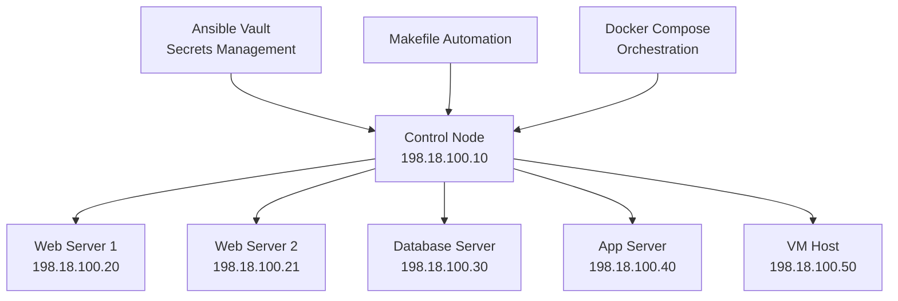

# 01 - Introdução ao Ansible Lab

**🏷️ Tags:** `#setup` `#introduction`  
**📅 Criado:** Janeiro 2026  
**👤 Autor:** [@rafaelmfried](https://github.com/rafaelmfried)

---

## 🎯 Objetivos do Lab

### **Por que este lab foi criado?**

Este laboratório foi desenvolvido para fornecer um ambiente **seguro, isolado e realista** para aprender Ansible sem comprometer sistemas reais. O foco principal está em:

#### **🔐 Segurança em Primeiro Lugar**

- **Proteção de credenciais** em repositórios públicos
- **Gerenciamento de secrets** com Ansible Vault
- **Boas práticas** de DevSecOps desde o início

#### **🌟 Aprendizado Prático**

- **Ambiente multi-container** simulando infraestrutura real
- **Scenarios progressivos** do básico ao avançado
- **Documentação detalhada** para cada conceito

#### **🚀 Preparação para o Mundo Real**

- **Workflows profissionais** com CI/CD
- **Patterns empresariais** de organização
- **Troubleshooting** de problemas comuns

---

## 🏗️ Arquitetura do Lab

### **Componentes Principais**

### **Tecnologias Utilizadas**

| Componente     | Tecnologia    | Versão      | Propósito                             |
| -------------- | ------------- | ----------- | ------------------------------------- |
| **OS Base**    | Debian        | 13 (Trixie) | Sistema operacional moderno e estável |
| **Python**     | Python        | 3.13        | Runtime para Ansible                  |
| **Ansible**    | Ansible Core  | Latest      | Ferramenta de automação               |
| **Containers** | Docker        | 20.10+      | Isolamento e portabilidade            |
| **Networking** | Docker Bridge | Custom      | Rede isolada RFC 2544                 |
| **Secrets**    | Ansible Vault | Built-in    | Gerenciamento seguro de credenciais   |

---

## 🎓 Metodologia de Ensino

### **Abordagem Progressiva**

#### **Nível 1: Fundamentos** 📗

- Conectividade básica
- Comandos ad-hoc
- Inventários simples
- Conceitos de SSH

#### **Nível 2: Automação** 📘

- Playbooks estruturados
- Variáveis e templates
- Handlers e notificações
- Organização com roles

#### **Nível 3: Segurança** 📙

- Ansible Vault
- Gerenciamento de secrets
- Privilege escalation
- Boas práticas de segurança

#### **Nível 4: Produção** 📕

- CI/CD pipelines
- Testing automatizado
- Monitoring e logs
- Deployment strategies

### **Hands-on Learning**

Cada conceito é acompanhado de:

- ✅ **Explicação teórica** clara e concisa
- ✅ **Exemplo prático** funcionando
- ✅ **Exercícios** para fixação
- ✅ **Troubleshooting** de problemas comuns

---

## 🗺️ Próximos Passos

1. **[02-prerequisitos](02-prerequisitos.md)** - Verificar dependências
2. **[03-instalacao-basica](03-instalacao-basica.md)** - Setup inicial
3. **[04-conceitos-vault](04-conceitos-vault.md)** - Entender segurança

---

## 💬 Feedback e Contribuições

Este lab é um **projeto vivo** e está sempre evoluindo. Suas contribuições são bem-vindas:

- 🐛 **Issues**: Reportar bugs ou problemas
- 💡 **Features**: Sugerir melhorias
- 📝 **Docs**: Melhorar documentação
- 🔧 **Code**: Contribuir com código

**Repositório:** https://github.com/rafaelmfried/ansible-lab

---

**🎯 Objetivo:** Criar uma base sólida para sua jornada com Ansible, priorizando segurança e boas práticas desde o primeiro dia!
