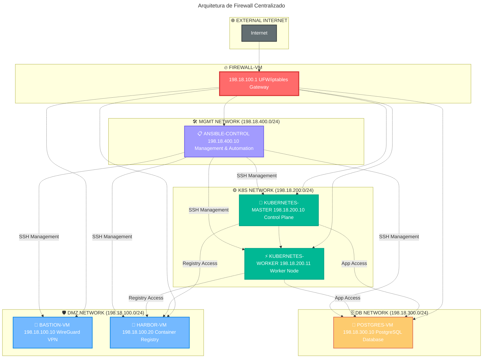

# 04 - Arquitetura com Firewall Central

**🏷️ Tags:** `#firewall` `#security` `#gateway` `#network-isolation`  
**📅 Atualizado:** Janeiro 2026  
**👤 Autor:** [@rafaelmfried](https://github.com/rafaelmfried)  
**🌿 Branch:** `firewall-architecture`

---

## 🎯 Objetivo

Implementar **firewall centralizado** que atue como gateway de todas as comunicações entre redes, controlando o tráfego com UFW/iptables e garantindo isolamento completo entre segmentos de rede.

---

## �️ Arquitetura com Firewall

### **Componentes da Infraestrutura**



### **🖥️ Máquinas Virtuais**

| VM                    | IP            | Rede       | Função             | Portas          |
| --------------------- | ------------- | ---------- | ------------------ | --------------- |
| **firewall-vm**       | 198.18.100.1  | Todas      | Gateway/Firewall   | 22              |
| **bastion-vm**        | 198.18.100.10 | DMZ        | VPN Access         | 22, 51820/udp   |
| **harbor-vm**         | 198.18.100.20 | DMZ        | Container Registry | 22, 80, 443     |
| **kubernetes-master** | 198.18.200.10 | K8s        | Control Plane      | 22, 6443, 10250 |
| **kubernetes-worker** | 198.18.200.11 | K8s        | Worker Node        | 22, 10250       |
| **postgres-vm**       | 198.18.300.10 | Database   | PostgreSQL         | 22, 5432        |
| **ansible-control**   | 198.18.400.10 | Management | Automation         | 22              |

## 🛡️ Configuração do Firewall

### **Firewall-VM: Gateway Central**

O **firewall-vm** atua como gateway central controlando todo tráfego entre redes:

```bash
# Arquivo: firewall/rules.conf

# 1. BASTION ACCESS (DMZ)
# Permite WireGuard de fora, bloqueia acesso direto interno
firewall-vm -> bastion-vm: 51820/udp, 80, 443
bastion-vm -> firewall-vm: permitir VPN estabelecida

# 2. HARBOR ACCESS (DMZ)
# Registry acessível do K8s, bloqueado do DB
k8s-network -> harbor-vm: 80, 443, 5000
firewall-vm: BLOCK harbor-vm -> db-network

# 3. KUBERNETES ACCESS
# K8s pode acessar Harbor e PostgreSQL
k8s-network -> harbor-vm: 80, 443, 5000
k8s-network -> postgres-vm: 5432
firewall-vm: BLOCK k8s-network -> external (exceto registry)

# 4. DATABASE ACCESS
# PostgreSQL isolado - apenas K8s e management
k8s-network -> postgres-vm: 5432
mgmt-network -> postgres-vm: 22, 5432
firewall-vm: BLOCK dmz-network -> postgres-vm

# 5. MANAGEMENT ACCESS
# Ansible pode gerenciar todas as VMs
mgmt-network -> all-vms: 22
firewall-vm: ALLOW mgmt-network -> all-networks
```

### **Implementação com UFW/iptables**

```bash
# Configurar firewall-vm como gateway
sudo docker exec -it firewall-vm bash

# 1. Habilitar encaminhamento IP
echo 'net.ipv4.ip_forward=1' >> /etc/sysctl.conf
sysctl -p

# 2. Configurar UFW básico
ufw default deny incoming
ufw default allow outgoing
ufw default allow forward

# 3. Permitir SSH administrativo
ufw allow 22/tcp

# 4. Regras entre redes
# DMZ -> K8s (Harbor access)
ufw allow in on eth0 out on eth1
# K8s -> DB (App access)
ufw allow in on eth1 out on eth2 to any port 5432
# MGMT -> All (Admin access)
ufw allow in on eth3

# 5. NAT para acesso externo
iptables -t nat -A POSTROUTING -o eth+ -j MASQUERADE
iptables-save > /etc/iptables/rules.v4

# 6. Ativar firewall
ufw enable
```

## 🧪 Testes de Conectividade

### **Scripts de Teste Automatizado**

```bash
#!/bin/bash
# firewall/test-connectivity.sh

echo "🔥 Testando regras do firewall..."

# 1. Teste DMZ -> K8s (deve funcionar para Harbor)
echo "📋 DMZ -> K8s Harbor access:"
docker exec -it kubernetes-master curl -s harbor-vm:80 && echo "✅ OK" || echo "❌ FAIL"

# 2. Teste DMZ -> DB (deve falhar)
echo "📋 DMZ -> Database (deve falhar):"
docker exec -it bastion-vm nc -z postgres-vm 5432 && echo "❌ FAIL (security issue!)" || echo "✅ OK (blocked)"

# 3. Teste K8s -> DB (deve funcionar)
echo "📋 K8s -> Database:"
docker exec -it kubernetes-master nc -z postgres-vm 5432 && echo "✅ OK" || echo "❌ FAIL"

# 4. Teste External -> Bastion VPN (deve funcionar)
echo "📋 External -> Bastion VPN:"
nc -u -z localhost 51820 && echo "✅ OK" || echo "❌ FAIL"

# 5. Teste MGMT -> All (deve funcionar)
echo "📋 Management -> All VMs:"
for vm in bastion-vm harbor-vm kubernetes-master postgres-vm; do
    docker exec -it ansible-control nc -z $vm 22 && echo "✅ $vm SSH OK" || echo "❌ $vm SSH FAIL"
done

echo "🎯 Testes concluídos!"
```

### **Monitoramento de Logs**

```bash
# Ver logs do firewall em tempo real
docker exec -it firewall-vm tail -f /var/log/ufw.log

# Ver tentativas de conexão bloqueadas
docker exec -it firewall-vm journalctl -u ufw -f

# Verificar estatísticas iptables
docker exec -it firewall-vm iptables -L -n -v
```

## 🎯 Checklist de Implementação

### **Infraestrutura Base**

- [ ] firewall-vm configurado como gateway
- [ ] 4 redes Docker isoladas criadas
- [ ] 6 VMs especializadas deployadas
- [ ] Conectividade entre redes validada
- [ ] UFW/iptables regras aplicadas

### **Segurança**

- [ ] Firewall rules implementadas
- [ ] DMZ isolada do Database
- [ ] K8s com acesso controlado
- [ ] Management network privilegiado
- [ ] Logs de segurança ativos

### **Serviços Especializados**

- [ ] WireGuard VPN funcionando
- [ ] Harbor registry operacional
- [ ] Kubernetes cluster ativo
- [ ] PostgreSQL isolado e seguro
- [ ] Ansible automation pronto

### **Testes**

- [ ] Scripts de teste rodando
- [ ] Isolamento de redes validado
- [ ] Conectividade autorizada OK
- [ ] Logs de firewall monitored
- [ ] Performance de rede adequada

---
